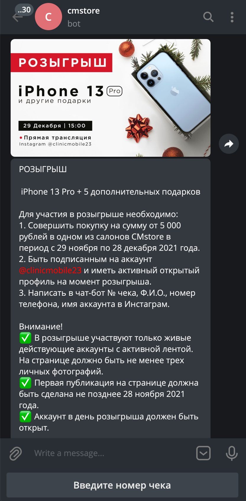
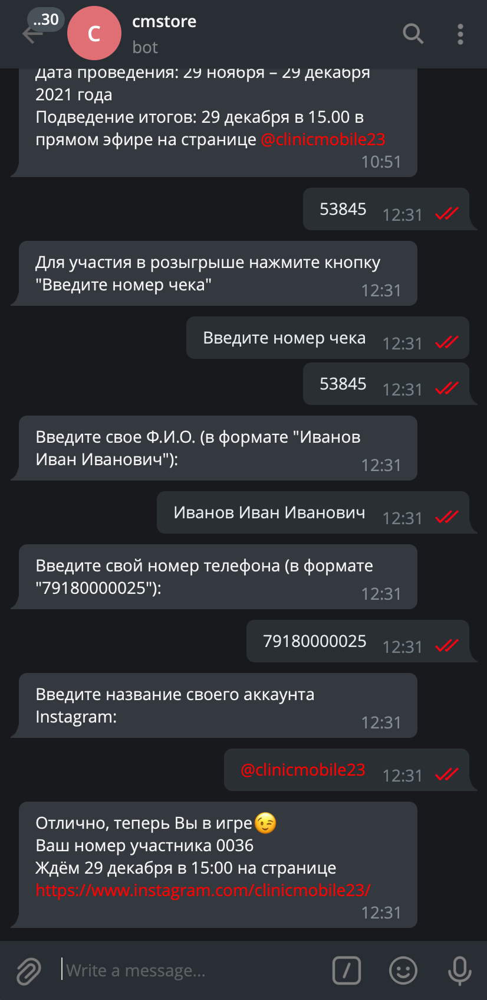
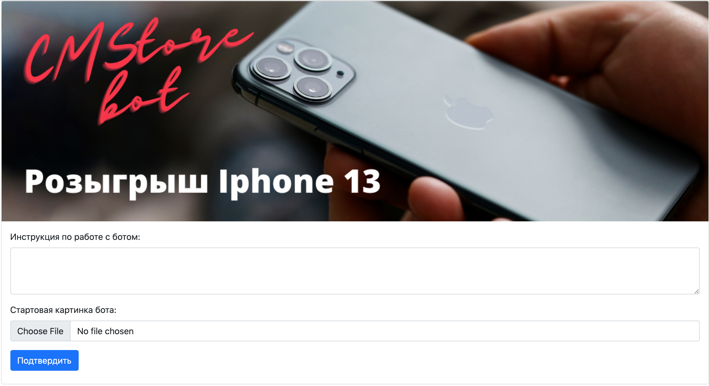

# Bot розыгрыша iphone 13 для CM-Store

Бот предназначен для регистрации участников розыгрыша. В качестве бэкенда используется конфигурация 1С.

|  |  

# Содержание

- [Установка](#установка)
  - [Переменные окружения](#установите-переменные-окружения)
- [Процедура запуска](#процедура-запуска)
  - [Запуск сервера](#запуск-сервера)
  - [Добавление стартовой картинки и текста](#добавление-стартовой-картинки-и-текста)
  - [Запуск бота](#запуск-бота)
  - [Запуск сервера и бота как сервисов](#запуск-сервера-и-бота-как-сервисов)

# Установка

Клонируйте репозиторий, и создайте виртуальное окружение. После этого установите зависимости:

```bash
$ python3 -m venv env
$ . env/bin/activate
(env) $ pip install -r requirements.txt
```

## Установите переменные окружения

`SERV_HOST` - IP адрес хоста на котором запускается сервер.

`SERV_PORT` - Порт поста на котором запускается сервер.

`TG_BOT_TOKEN` - Токен телеграмм бота.

`REDIS_HOST` - Хост базы данных Redis.

`REDIS_PORT` - Порт базы данных Redis.

`USE_WEBHOOK` - Использование подключение бота к серверу телегам через webhook. Если Ложь, то выполняется polling подключение.

`WEBHOOK_HOST` - URL адрес webhook сервера. Подключение выполняется по ssl протоколу.

`WEBHOOK_PATH` - Путь подключения к webhook серверу, по умолчанию "/".

`WEBAPP_HOST` - Хост запуска телеграм бота по технологии webhook.

`WEBAPP_PORT` - Порт запуска телеграм бота по технологии webhook.

`SMS_API_ID` - API ID сервиса sms.ru, для отправки смс сообщений о участии в розыгрыше. Если пустая, то отправка не происходит.

`URL_1C` - URL адрес опубликованного http сервиса 1с, для проверки и сохранения введенных регистрационных данных.

`INSTA_LOGIN` - Логин фейкового аккаунта instagram, для проверки валидности введенного пользователем аккаунта при регистрации.

`INSTA_PASSWORD` - Пароль фейкового аккаунта instagram, для проверки валидности введенного пользователем аккаунта при регистрации.

`CHAT_IDS_DELETED_MESSAGES` - Список chat id, для которых будет удалятся история сообщений.

`MONITORING_SERVER` - Адрес запущенного сервиса мониторинга работоспособности бота.

`ROLLBAR_TOKEN` - Токен для Rollbar сервиса.


# Процедура запуска


## Запуск сервера:

```bash
$ python serv.py
```

## Добавление стартовой картинки и текста:

Перейдите на адрес хоста указанного в соответствующей переменной окружения, по умолчанию [127.0.0.1:5000](http://127.0.0.1:5000/), и введите текст приветствия и картинку, после чего нажмите Подтвердить.

## Запуск бота:

```bash
$ python main.py
```


## Запуск сервера и бота как сервисов:

Скопировать `cmstore.service` и `cmstore_bot.service` в `/etc/systemd/system/`, затем:
```bash
systemctl start cmstore.service
systemctl enable cmstore.service
```
```bash
systemctl start cmstore_bot.service
systemctl enable cmstore_bot.service
```
Убедиться, что сервис работает:
```bash
systemctl status cmstore.service
systemctl status cmstore_bot.service
```
